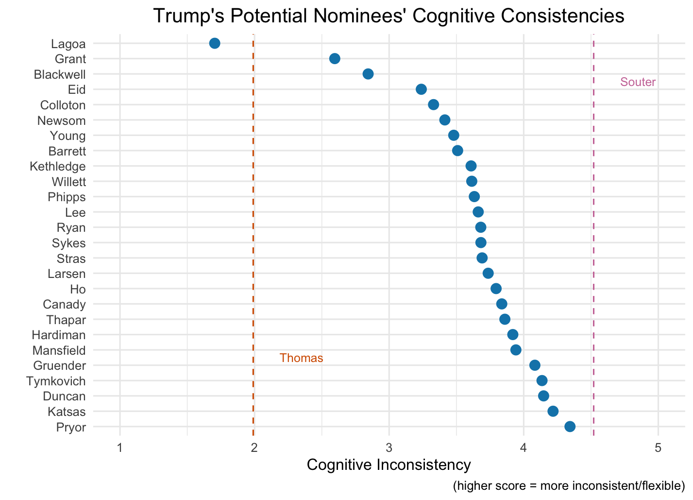
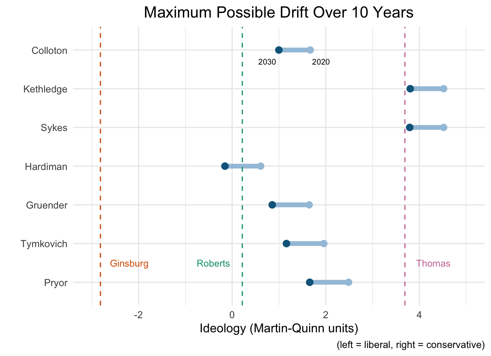

## Basic procedure

Methodology is the same as presented in Owen's and Wedeking's 2012 JOP article (["Predicting Drift on Politically Insulated Institutions: A Study of Ideological Drift on the United States Supreme Court"](https://www.journals.uchicago.edu/doi/abs/10.1017/S0022381611001691)).

I analyzed the 30 people on Trump's list who are currently sitting as a circuit court judge or state supreme court judge. I dropped 4 people who had too few prior opinions to generate a reliable cognitive consistency score, leaving 26 people total.

For the drift projections, I relied upon the Judicial Common Space scores developed by [Epstein et al.](http://epstein.wustl.edu/research/JCS.html). Following their specification, I transformed these scores into Martin-Quinn units for comparison to Owens and Wedeking's original analysis.

## Figures

1. 

2. 