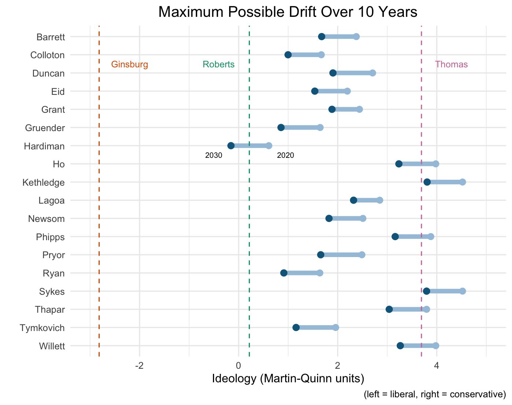

# Which of Trump’s Supreme Court choices will be the most reliable?

## Background
Five times, Republicans have nominated a supposed ["home run for conservatives"](https://www.weeklystandard.com/jeremy-rabkin/the-sorry-tale-of-david-souter-stealth-justice) to the Supreme Court. And five times, they have gotten it wrong -- the nominee, who looked conservative on paper, actually turned out to be a liberal on the Court. (Think, for example, of Blackmun, Souter, Stevens, Kennedy, or O'Connor.) Why does this happen? And what might this mean for the Republicans' newest nominee?

In a 2012 JOP article (["Predicting Drift on Politically Insulated Institutions: A Study of Ideological Drift on the United States Supreme Court"](https://www.journals.uchicago.edu/doi/abs/10.1017/S0022381611001691)), Owens and Wedeking found that ideological drift on the Supreme Court is best explained by a measure of a justice's pre-nomination "cognitive consistency." Here, I bring their findings to bear on the list of potential nominees that Trump has floated to replace Ruth Bader Ginsburg.

See below for visualizations of my findings and the technical steps involved for replication.

## Figures

1. 

2. 

## Procedure

1. Query LexisNexis for each nominee's separate (i.e., concurring and dissenting) opinions. (Intuition: Only texts where a judge is writing for himself, and not trying to accommodate others' views, are representative of a judge's own cognitive state.)

	```
	concurby(NAME) or dissentby(NAME)
	```

2. Download the Lexis case results as .rtf files and then convert them into .txt files using `textutil`.

	```
	textutil -convert txt *.rtf
	rm *.rtf
	```

3. Run the parser script to extract the relevant opinion from the case documents.

	```
	python parser.py
	```

4. Delete opinions containing the following text. (Intuition: These phrases, common on state courts, indicate that the opinion was joined by someone else.)

	```
	authorized to state
	authorized to say
	```

5. Delete any documents less than 150 bytes. (Intuition: Texts with with only a few words simply contribute noise to the model.)

	```
	find . -name '*.txt' -type 'f' -size -150c -delete
	```

6. Manually run the LIWC program on the parsed documents. (No command line interface.)

7. Run the analysis script to standardize the LIWC results, calculate each document's complexity score, and compute each potential nominee's consistency score.

	```
	Rscript analysis.R
	```

8. Run the figures script to generate visualizations of the results.

	```
	Rscript figures.R
	```
	
## Technical notes

1. Trump's [list of potential nominees](https://www.npr.org/sections/death-of-ruth-bader-ginsburg/2020/09/19/914760626/the-names-on-trumps-list-of-potential-supreme-court-nominees) contains 44 people, but only 30 of them are prior judges. Thus, the 14 non-judges on his list are necessarily omitted from this analysis.

2. Of those 30, 4 people are too new to have written many opinions yet, so a reliable cognitive consistency score for them cannot be calculated. Thus, only 26 people are included in the final version of this analysis.

3. The ideology scores for the nominees are calculated using the Judicial Common Space (JCS) method devised by [Epstein et al. (2007)](http://epstein.wustl.edu/research/JCS.html), which estimates each federal judge's ideology according to the [NOMINATE scores](https://voteview.com/) of the judge's home state senators. (This method exploits the "blue slip" norm in the judicial confirmation process.) However, this only works for judges who sit on the federal circuit, so state judges are not included in the drift prediction part of the analysis.

4. Because Owens and Wedeking's prediction models use [Martin-Quinn scores](http://mqscores.lsa.umich.edu/) as their ideology unit, however, it is necessary to transform each nominee's ideology score from JCS units into Martin-Quinn units. To do so, I simply use the inverse of the trigonometric transformation function that Epstein et al. derive.

5. To estimate the "maximum" possible drift for each nominee over ten years, I make the simple assumption that judges only drift unidirectionally (and only leftward), setting an upper bound on their average per year drift over time. (Of course, in reality, judges could drift much less than the maximum I calculate. And this prediction is subject to the confidence intervals that accompany Owens and Wedeking's original model. Miracles can always happen.)